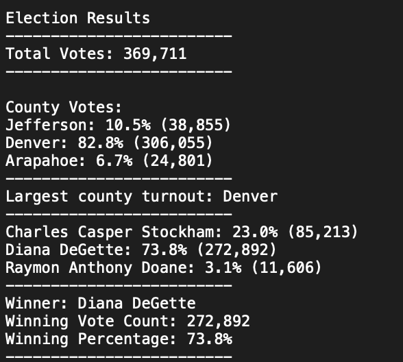

# election_analysis

## Overview
The purpose of the election audit analysis is to compile the results of the election, and determine the winner of the election based on popular vote. The results are reported to the Colorado Board of Elections. 

### Explainer on Raw Data
Each row of raw data consists of:
- Ballot ID
- County
- Candidate

Ballot ID is the unique identifier, and there are 369,711 rows of data, representing 369,711 votes.

The code examines each row, while tabulating the number of votes for each candidate in the dictionary candidate_votes, and by county in the dictionary county_votes. 

## Results
The results of the election per the audit are as follow:

- The total votes cast in the congressional election is 369,711
- Each county in the precinct had the following proportion of votes (total number of votes in brackets): Jefferson County, 10.%% (38,855), Denver County, 82.8% (306,055), Arapahoe County, 6.7% (24,801)
- The county with the largest number of votes is Denver
- Each candidate received the following proportion of votes (total number of votes in brackets): Charles Casper Stockham, 23.0% (85,213), Diana DeGette, 73.8% (272,892), Raymon Anthony Doane, 3.1% (11,606)
- Diana DeGette won the election, with 272,892 votes, representing 73.8% of the total votes. 

## Summary

The script can be used for any election, as long as the file path is clearly defined in line 9.

To modify the output of the the script, make changes starting at line 88.

    # Print the final vote count (to terminal)
    election_results = (
        f"\nElection Results\n"
        f"-------------------------\n"
        f"Total Votes: {total_votes:,}\n"
        f"-------------------------\n\n"
        f"County Votes:\n")
    print(election_results, end="")

The text inside the f string f" can be modified

Another statistic that we can add to the script is the eligible voting population for each county. From there, we can calculate the voter turnout for each county by dividing the total votes by the eligible voting population. 